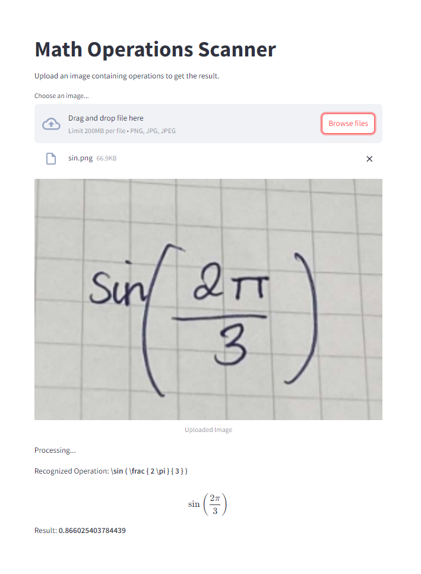

# Math Operations Scanner

## Introduction

Math Operations Scanner is a web application that allows users to upload images containing operations. The app utilizes advanced machine learning techniques to recognize mathematical expressions from images and computes the results automatically using the Mathematical Formula Recognition (MFR) model from [Pix2Text (P2T)](https://huggingface.co/breezedeus/pix2text-mfr).



## Features

- **Image Upload**: Easily upload images containing operations.
- **Automatic Recognition**: The app recognizes and extracts expressions from the uploaded images using the MFR model from [Pix2Text (P2T)](https://huggingface.co/breezedeus/pix2text-mfr).
- **Calculation**: The recognized expressions are evaluated, and the results are displayed.
- **User-Friendly Interface**: Built using Streamlit, providing an intuitive and interactive user experience.

## Requirements

Before running the application, ensure you have the following prerequisites installed:

- Python 3.7 or later
- Install Required Libraries

```
! pip install transformers>=4.37.0 pillow optimum[onnxruntime]
```

```
pip install streamlit
```

```
pip install latex2sympy2
```

### Run app

- To the terminal, enter the following:

```
streamlit run streamlit_app.py
```
